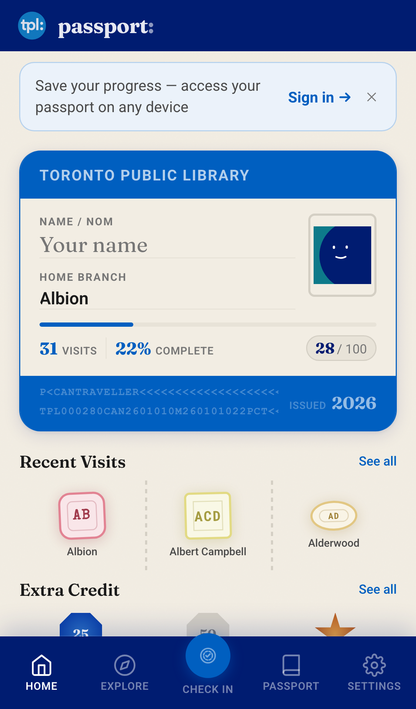
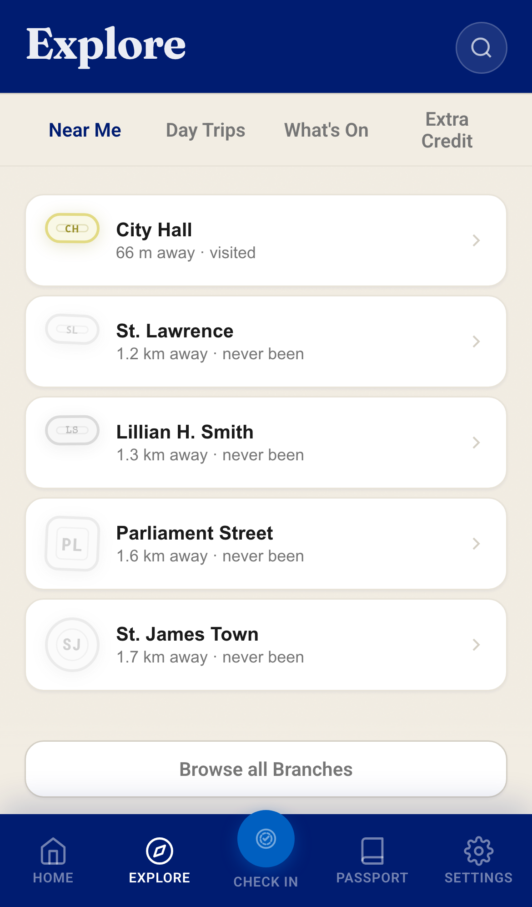
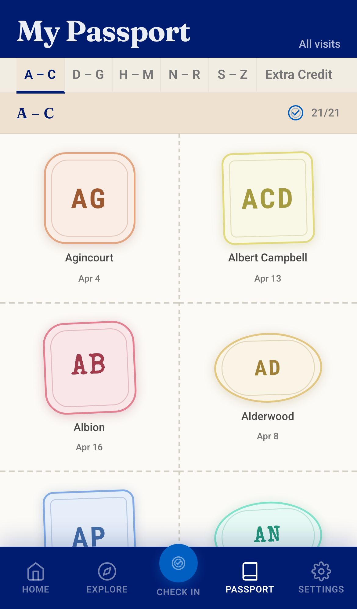
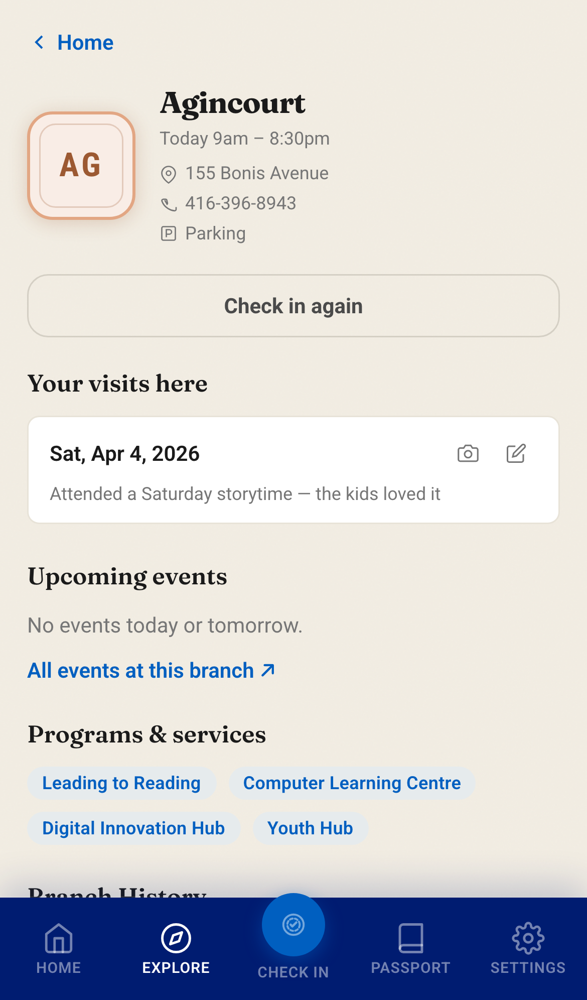

# TPL Passport

A mobile-first stamp-collecting app for the Toronto Public Library. Visit branches, collect stamps, earn badges, and fill your passport.

  
  
  
  

_Screenshots are representative and may lag the current UI._

## Try it

Open the app on your phone for the best experience — it's designed as a mobile PWA and can be added to your home screen.

## What's in the app

| Screen | Description |
|--------|-------------|
| **Home** | Passport progress, recent visits, and earned badges; sign-in prompt for logged-out users |
| **Explore** | Four tabs: nearby branches, walking day-trips, upcoming events, and badge suggestions |
| **Check In** | Select a branch, add an optional note or photo, verify proximity, earn a stamp |
| **Passport** | Stamp book across 5 alphabetical pages + an Extra Credit page for badges |
| **History** | Check-in log grouped by recency; filter to visits with notes or photos |
| **Branch detail** | Branch info, hours, events, and services |
| **Settings** | Sign in/out, theme picker (Light / Auto / Dark), dev-only demo mode |
| **QR Print** | Printable branch QR codes for check-in campaigns |

## Stack

- **Nuxt 4** (SPA mode — `ssr: false`)
- **Pinia** for state, persisted to `localStorage`
- **Better Auth + Turso (libSQL)** — email/password and Google OAuth; cross-device sync
- **Vercel** for hosting

Branch and route data is static JSON in `packages/shared/data/`, sourced from the [Toronto Open Data](https://open.toronto.ca/) portal.

## Commands

- `npm run dev` — start local development server
- `npm test` — run tests once
- `npm run test:watch` — run tests in watch mode
- `npm run test:e2e` — run Playwright end-to-end regression tests
- `npm run lint` — run ESLint checks
- `npm run lint:fix` — auto-fix lint issues where possible
- `npm run build` — build for production
